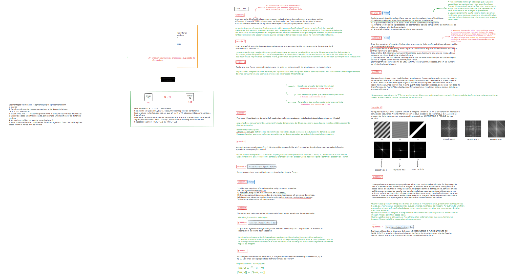

# pdi_dca0445

> Repositório dedicado a implementações e anotações sobre a disciplina de Processamento Digital de Imagens - DCA0445 - UFRN - DCA (Departamento de Computação e Automação)

**obs**: todos os códigos para a realização das práticas e laboratórios foram baseados nos códigos do professor Agostinho disponíveis [aqui](https://agostinhobritojr.github.io/tutorial/pdi/)

## 🚀 Unidade I

Na Unidade 1 da disciplina de `Processamento Digital de Imagens`, foram abordados os fundamentos essenciais para a compreensão e manipulação de imagens digitais. Iniciamos com uma **introdução aos fundamentos de imagens digitais**, onde exploramos as etapas do processamento de imagens e a representação digital das mesmas. Em seguida, conhecemos a **biblioteca OpenCV**, com duas aulas práticas em laboratório, que permitiram aplicar conceitos em tarefas reais. Estudamos as relações entre pixels e as transformações geométricas aplicadas em imagens, além dos **modelos de cor**. A **manipulação de histogramas** foi abordada, destacando a importância da distribuição de intensidade para o realce de imagens. Finalmente, discutimos os princípios da **convolução digital e filtros espaciais**, essenciais para a aplicação de técnicas de suavização e realce em imagens.

## 🚀 Unidade II

Na Unidade 2 da disciplina de `Processamento Digital de Imagens`, aprofundamos nossos estudos com técnicas mais avançadas para o tratamento e análise de imagens digitais. Iniciamos com a **Transformada de Fourier**, onde estudamos a representação de imagens no domínio da frequência e suas aplicações na análise de componentes de frequência baixa e alta. Em seguida, exploramos a **Filtragem no domínio da frequência**, aplicando filtros para a remoção de ruídos e o realce de detalhes específicos nas imagens. Na aula sobre **Restauração de imagens**, aprendemos a corrigir imagens degradadas, recuperando informações perdidas através de técnicas matemáticas e computacionais. Finalizamos a unidade com o estudo da **Segmentação de imagens e limiarização**. A segmentação permite dividir a imagem em regiões de interesse, facilitando a análise e o processamento de objetos, enquanto a limiarização é aplicada para a binarização de imagens, destacando elementos específicos com base em seus níveis de intensidade.

- resposta da lista 2 

## 🚀 Unidade III

### 🎯 Atividades/projetos

- [📌 link das atividades](https://carlosg18.github.io/pdi_dca0445/)
